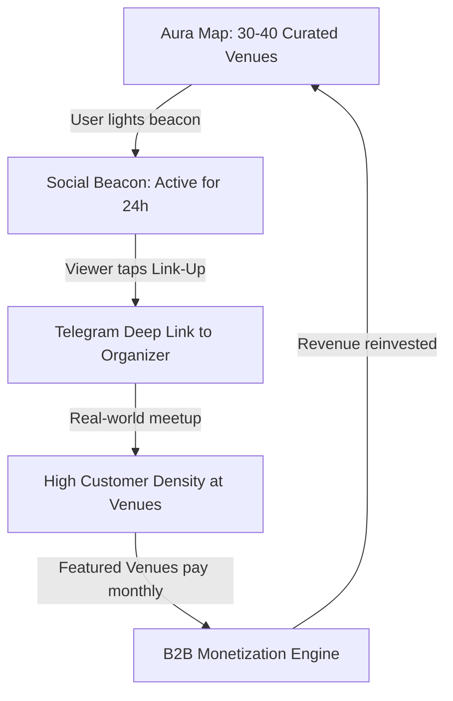

# Business Requirements Document (BRD) — Aura MVP

**Project Name:** Aura  
**Version:** 2.0 (MVP Scope)  
**Author:** Antigravity  
**Date:** June 9, 2026  
**Status:** Draft  

---

## 1. Executive Summary
Aura is a mobile-first Progressive Web Application (PWA) at the intersection of a curated interactive map and a real-time social layer, built specifically for urban wellness communities. Its mission is to bridge the gap between digital wellness and real-life connections, making the transition from "wanting to work out" to "sitting at a café with a like-minded person" take only a few taps.

Unlike generic map applications (e.g., Google Maps, 2GIS) that suffer from informational overload, Aura serves as a highly curated city guide containing 30–40 hand-picked, photogenic wellness venues (studios, specialty coffee shops, spa zones). It provides a lightweight, real-time social coordinator ("Social Beacons") for joint workouts, matcha runs, and mindful meetups.

---

## 2. Business Problem & Opportunity

### 2.1 The Problem Statement
1. **Decision Fatigue & Noise**: Modern city maps are cluttered with irrelevant locations (auto-repair shops, pharmacies, utility offices). Discovering high-quality, aesthetic wellness spaces requires digging through social media recommendations.
2. **Social Isolation in Niche Communities**: Finding companions for conventional social activities (like drinking at a bar) is easy. Finding a partner for a 7:00 AM Pilates class followed by a specialty matcha latte is difficult. Existing messaging groups (Telegram, WhatsApp) are chaotic and lack context, while dating apps (Tinder, Bumble) carry inappropriate connotations.
3. **B2B Customer Acquisition**: Premium local wellness studios and specialty cafes struggle to acquire highly targeted customers through saturated social media marketing. They lack a direct channel to users who are actively looking to visit wellness locations.

### 2.2 The Market Opportunity
There is a rapidly growing demographic of health-conscious urban professionals, expats, and students (aged 18–30) centered around "aesthetic wellness." Aura captures this high-lifetime-value audience by offering them a curated digital map layer and a seamless, zero-friction connection tool.

---

## 3. Product Vision & Strategy



### 3.1 The "City Wellness Layer" Protocol
Aura is positioned not just as a local app for Almaty, but as a repeatable, city-specific wellness layer protocol.
* **Launch City**: Almaty, Kazakhstan (due to high density of wellness culture, active community, and quick local distribution).
* **Scaling Strategy**: Zero city-specific codebase changes. Launching a new city (e.g., Istanbul, Dubai, Tbilisi) only requires seeding 30–40 hand-picked locations in the database admin panel.

---

## 4. Business Goals & Key Performance Indicators (KPIs)

To validate Product-Market Fit (PMF) during the 6-week MVP period, the project will track the following metrics:

| Metric | Target (End of Week 6) | Description |
|---|---|---|
| **User Acquisition** | 100+ Active Users | Seed users onboarded through local communities and partners. |
| **Beacon Creation Rate** | 20+ beacons/week | Measures community engagement and user activity. |
| **Link-Up Conversion** | 30% of beacons joined | Percentage of beacons that result in a Telegram tap. |
| **B2B Onboarding** | 1 paying venue | Validates willingness to pay from premium venues. |
| **Weekly Retention** | 25% W1 Retention | Percentage of users returning to check active beacons weekly. |

---

## 5. Monetization Model

Aura implements a concrete three-tier monetization model designed to generate early ARR (Annual Recurring Revenue) with minimal sales overhead:

```
+-----------------------------------------------------------+
|                        MONETIZATION                       |
+-----------------------------------------------------------+
| [ Free Listing ]      -> Pin + Vibe Card, drop 3 beacons  |
|                          per week ($0/mo)                 |
+-----------------------------------------------------------+
| [ Aura Pro User ]     -> Unlimited beacons, advanced tags |
|                          beacon analytics ($4.99/mo)      |
+-----------------------------------------------------------+
| [ Featured Venue ]    -> Top search, "Featured" badge,    |
|                          push in feed, analytics ($49/mo) |
+-----------------------------------------------------------+
```

### 5.1 Business-to-Business (B2B) Tiers
1. **Free Venue Listing ($0)**:
   * Map pin and standard "Vibe Card" details.
   * Users can locate the venue and drop beacons over it.
2. **Featured Venue ($49–99/month)**:
   * High priority search placement.
   * Highlighted gold/featured pin styling on the Map.
   * Promoted beacons (bumped to the top of the feed once a week).
   * Simple venue dashboard with analytics (clicks on card, beacons dropped, meetups planned).
   * Direct marketing: Venues can post "Today's special" meetups as corporate beacons (e.g., *"Free matcha tasting at our studio, 14:00–16:00"*).

### 5.2 Business-to-Consumer (B2C) Tiers
1. **Free User ($0)**:
   * View map and active beacons as a guest.
   * Onboard via Google Social Auth or Email/Password credentials to obtain a secure JWT session.
   * Create up to 3 beacons per week (tracked securely on backend profile model).
   * Redirect to Telegram for meetups.
2. **Aura Pro User ($4.99/month)**:
   * Verified via JWT payload claims.
   * Unlimited beacons.
   * Advanced beacon styling (custom colors, emoji indicators).
   * Custom vibe tags on meetups.
   * Profile badge ("Aura Pioneer").

---

## 6. User Retention & Growth Loops

To solve the cold-start problem and keep users coming back daily without internal messaging, the following mechanics are integrated:

* **Beacon Expiry Loop**: Beacons automatically expire 2 hours after their scheduled event time. This guarantees that map pins and the meetup feed are always current, encouraging users to check the app daily.
* **"What's Happening Today" Daily Feed**: A clean home screen list of meetups happening in the next 24 hours, opening like a daily bulletin board.
* **Weekly Featured Beacon**: Every Monday, the beacon with the highest engagement from the previous week is featured on the app landing page and social media, providing social validation.
* **Viral Story Cards (Share to Stories)**: Meeting creators can download a styled, glassmorphic image card of their meetup to share on Instagram or Telegram Stories, serving as a zero-cost referral engine.
