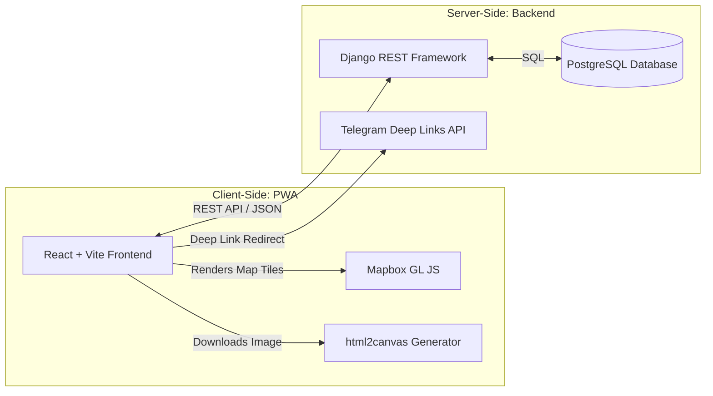
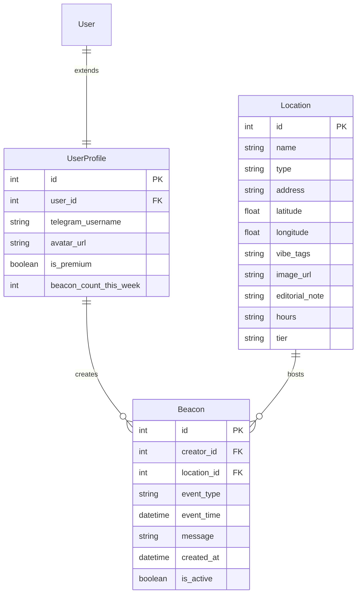

# Technical Requirements Document (TRD) — Aura MVP

**Project Name:** Aura  
**Version:** 2.0 (MVP Scope)  
**Author:** Antigravity  
**Date:** June 9, 2026  
**Status:** Draft  

---

## 1. System Architecture

Aura is structured as a decoupled client-server application optimized for lightweight deployment, high responsiveness, and zero-cost scaling during the MVP.



* **Frontend**: React SPA built with Vite, styled with Tailwind CSS, and compiled to static assets deployed on Vercel.
* **Backend**: Django REST Framework (DRF) serving JSON APIs, running in a containerized environment on Railway or Render.
* **Database**: PostgreSQL (provided natively or via Supabase) storing locations, profiles, and beacons.
* **Mapping**: Mapbox GL JS SDK v3 client-side loading, rendering custom vector tiles.
* **External Integration**: Direct browser-level integration with the Telegram app schema.

---

## 2. Database Schema (Django Models)

The entity relationships are designed to be extremely clean. The backend enforces referential integrity and supports fast querying of active meetups.



### 2.1 UserProfile Model
Extends the default Django `User` model to track application-specific state.
```python
from django.db import models
from django.contrib.auth.models import User

class UserProfile(models.Model):
    user = models.OneToOneField(User, on_delete=models.CASCADE, related_name='profile')
    telegram_username = models.CharField(max_length=32, unique=True)
    avatar_url = models.URLField(blank=True, null=True)
    is_premium = models.BooleanField(default=False)
    created_at = models.DateTimeField(auto_now_add=True)

    def __str__(self):
        return f"{self.user.username} (@{self.telegram_username})"
```

### 2.2 Location Model
Holds information for the hand-picked wellness spots.
```python
class Location(models.Model):
    TIER_CHOICES = [
        ('FREE', 'Free'),
        ('FEATURED', 'Featured'),
    ]
    CATEGORY_CHOICES = [
        ('STUDIO', 'Pilates & Yoga Studio'),
        ('CAFE', 'Specialty Coffee'),
        ('ORGANIC', 'Juice & Health Bar'),
        ('SPA', 'Spa & Wellness Zone'),
    ]

    name = models.CharField(max_length=100)
    category = models.CharField(max_length=20, choices=CATEGORY_CHOICES)
    address = models.CharField(max_length=255)
    latitude = models.DecimalField(max_digits=9, decimal_places=6)
    longitude = models.DecimalField(max_digits=9, decimal_places=6)
    vibe_tags = models.JSONField(default=list)  # Stored as list of strings, e.g., ["#SoftLight", "#NoLaptops"]
    image_url = models.URLField()
    editorial_note = models.TextField(max_length=250)
    operating_hours = models.CharField(max_length=100)
    tier = models.CharField(max_length=10, choices=TIER_CHOICES, default='FREE')

    def __str__(self):
        return self.name
```

### 2.3 Beacon Model
Stores user-created meetups. Enforces automated cleanups.
```python
from django.utils import timezone
from datetime import timedelta

class Beacon(models.Model):
    EVENT_CHOICES = [
        ('RUN', 'Run'),
        ('YOGA', 'Yoga/Pilates'),
        ('COFFEE', 'Coffee/Matcha'),
        ('SPA', 'Spa/Sauna'),
    ]

    creator = models.ForeignKey(UserProfile, on_delete=models.CASCADE, related_name='beacons')
    location = models.ForeignKey(Location, on_delete=models.CASCADE, related_name='beacons')
    event_type = models.CharField(max_length=15, choices=EVENT_CHOICES)
    event_time = models.DateTimeField()
    message = models.CharField(max_length=100)
    created_at = models.DateTimeField(auto_now_add=True)

    @property
    def is_expired(self):
        # Auto-expires 2 hours after the event time
        return timezone.now() > (self.event_time + timedelta(hours=2))
```

---

## 3. REST API Specifications

All endpoints communicate using standard JSON formatting. Authenticated requests use `Authorization: Token <token>` headers.

### 3.1 Locations API
* **List Venues**: `GET /api/locations/`
  * Query parameters: `city` (default Almaty)
  * Returns list of venues, including active beacon metadata.
* **Get Venue Details**: `GET /api/locations/<id>/`

### 3.2 Beacons API
* **List Active Beacons**: `GET /api/beacons/`
  * Filters out expired beacons automatically.
  * Returns:
    ```json
    [
      {
        "id": 104,
        "location_id": 12,
        "creator": {
          "username": "sofia_v",
          "telegram": "sofia_vibe"
        },
        "event_type": "YOGA",
        "event_time": "2026-06-12T11:00:00Z",
        "message": "Heading to Pilates! Matcha afterwards?"
      }
    ]
    ```
* **Create Beacon**: `POST /api/beacons/`
  * Body parameters: `location_id`, `event_type`, `event_time`, `message`.
  * Middleware checks user's quota (Free tier = 3/week).
* **Expire/Delete Beacon**: `DELETE /api/beacons/<id>/` (Allows the creator to manually extinguish their beacon).

---

## 4. Mapbox GL JS Integration

Aura utilizes the WebGL-powered Mapbox GL JS SDK to support smooth zooming, panning, and customized dark-themed layer styling.

* **Map Theme Configuration**:
  ```javascript
  import mapboxgl from 'mapbox-gl';

  mapboxgl.accessToken = import.meta.env.VITE_MAPBOX_ACCESS_TOKEN;
  const map = new mapboxgl.Map({
    container: 'map-container',
    style: 'mapbox://styles/aura-app/dark-v11-custom', // Custom dark layer
    center: [76.8897, 43.2389], // Center coordinates of Almaty
    zoom: 12.5,
    pitch: 45, // Angled map for premium feel
  });
  ```
* **Custom Pin Injectors**:
  Markers are instantiated using custom HTML elements styled with Tailwind glassmorphism tokens, injecting coordinates into mapboxgl instance.
* **Feature Clustering**:
  Mapbox's `supercluster` layout is configured to bundle pins that overlap on high-level zoom scopes, preventing visual clutter.

---

## 5. Viral Sharing Logic (html2canvas)

To download clean Meetup story cards:
1. React builds an off-screen HTML element populated with dynamic state (`venue.name`, `beacon.time`, `beacon.message`, and a generated QR code linking to Aura).
2. The `html2canvas` library converts the DOM node to a canvas.
3. The canvas exports a DataURL.
4. A download anchor triggers:
   ```javascript
   import html2canvas from 'html2canvas';

   const exportStoryCard = async (elementId) => {
     const element = document.getElementById(elementId);
     const canvas = await html2canvas(element, {
       useCORS: true, // Allow external venue images to render
       scale: 2,      // Export double resolution for crisp screens
     });
     const image = canvas.toDataURL('image/png');
     const link = document.createElement('a');
     link.download = `aura-meetup-${Date.now()}.png`;
     link.href = image;
     link.click();
   };
   ```

---

## 6. Security & Infrastructure Plan

### 6.1 Authentication Strategy
Aura uses JWT (JSON Web Tokens) for session management.
* **Credentials Flow**: Users register and log in via `/api/auth/register/` and `/api/auth/login/`, which returns a `refresh` token and an `access` token.
* **Google OAuth Flow**: Users authenticate with Google on the client, yielding an ID Token. The client sends this token to `/api/auth/google/`. The server verifies the token against Google's OAuth2 endpoints (using the `google-auth` library) and returns JWT tokens.
* **Token Verification & Refresh**: Access tokens expire in 15 minutes, while refresh tokens are valid for 7 days. The client sends the refresh token to `/api/auth/token/refresh/` to obtain a new access token transparently.
* **Protected Views**: Viewsets that mutate data (e.g. creating/joining beacons, updating user profiles) require `IsAuthenticated` check in Django REST framework permissions.

### 6.2 Server Cleanup (Cron Jobs)
To keep the database fast and prevent display of outdated meetups:
* A Celery or django-background-task script runs **every hour** to mark expired beacons as inactive:
  ```python
  # Cron script
  from django.utils import timezone
  from .models import Beacon

  def clean_expired_beacons():
      now = timezone.now()
      # Archive beacons where (event_time + 2 hours) is in the past
      Beacon.objects.filter(
          event_time__lt=now - timezone.timedelta(hours=2)
      ).delete()
  ```

### 6.3 Environment Configuration (Variables)
The following keys are required in production:

| Variable | Scope | Description |
|---|---|---|
| `DATABASE_URL` | Backend | Connection string for PostgreSQL database. |
| `SECRET_KEY` | Backend | Django cryptographic signature key. |
| `GOOGLE_CLIENT_ID` | Backend | Google Client ID used to verify Google tokens. |
| `VITE_GOOGLE_CLIENT_ID` | Frontend | Google Client ID for rendering Google Sign-In button. |
| `VITE_MAPBOX_ACCESS_TOKEN` | Frontend | Mapbox API credentials. |
| `VITE_API_BASE_URL` | Frontend | Django production domain (Vercel client config). |

